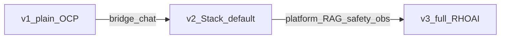
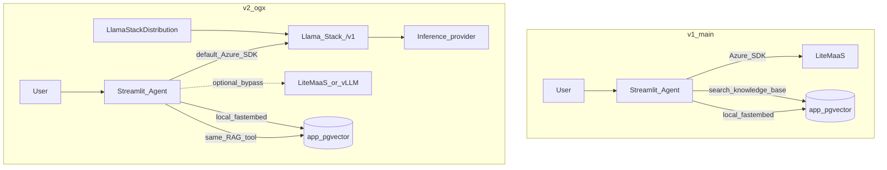
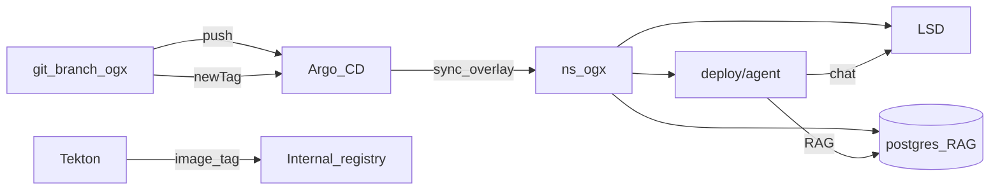
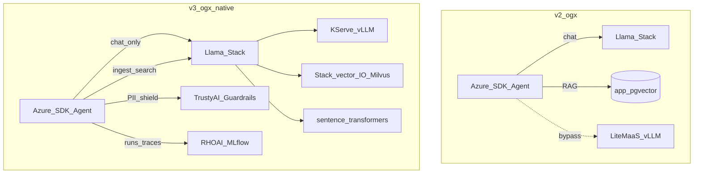
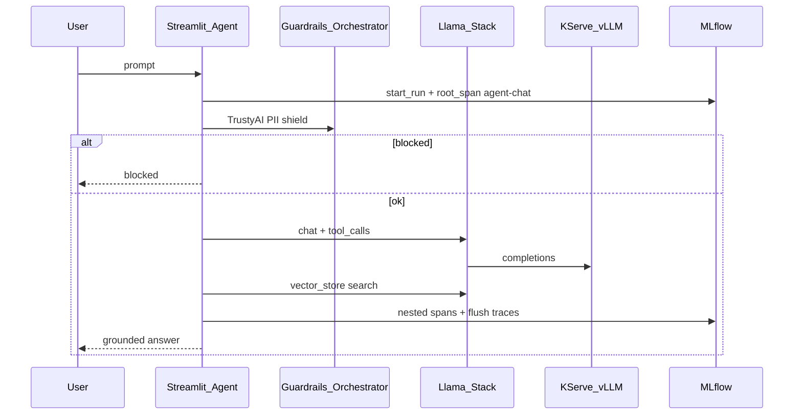
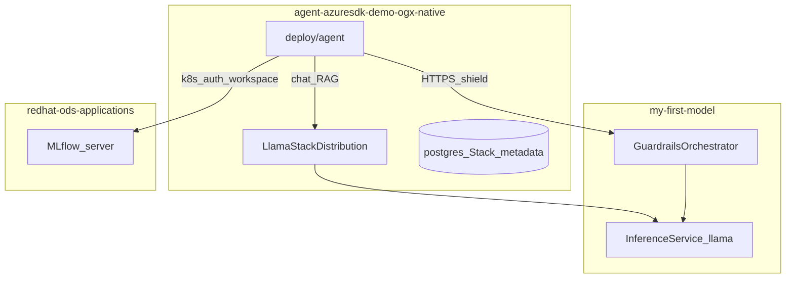

# Application & manifest changes

Delta guide for the Azure SDK agent POC across demo versions.

| Version | Branch | Namespace |
|---------|--------|-----------|
| **v1** | `main` | `agent-azuresdk-demo-main` |
| **v2** | `ogx` | `agent-azuresdk-demo-ogx` |
| **v3** | `ogx-native` | `agent-azuresdk-demo-ogx-native` |

**Constant across versions:** Azure AI Inference SDK agent loop (`azure-ai-inference`), Streamlit UI, tool name `search_knowledge_base`, Tekton build → internal registry, **strict GitOps** (Argo CD only applies overlays).



---

## v1 → v2 (bridge)

**Intent:** Keep the same agent and DIY RAG; land chat on OpenShift AI by defaulting the Azure SDK client to **Llama Stack** `/v1`. Optional UI bypass to LiteMaaS / vLLM for contrast only.

### Architecture change



### Application code

| Area | Change | Why |
|------|--------|-----|
| `app/config.py` | Drop hard-coded LiteMaaS URL/model defaults; LLM settings come from env / Secret | Secrets and provider switching must not bake prod URLs into the image |
| `app/main.py` | Provider switcher: `llamastack` (default), optional `litemaas` / `vllm`; snapshot `LITEMASS_*` / `LLAMA_STACK_*` / `VLLM_*` so Streamlit reruns do not clobber defaults; vLLM URL uses predictor **:8080** | Demo story = Stack first; bypass is contrast only; KServe headless SVC hits pod port 8080 |
| `app/agent/loop.py` | Prefer `AzureKeyCredential` for in-cluster `http://` endpoints; richer empty-content handling; shared `_complete()` with thinking disabled | TokenCredential requires HTTPS; LiteMaaS/Qwen “thinking” can return empty `content` |
| `app/db.py` / embeddings / RAG tool | **Unchanged contract** — still app Postgres + local embeddings | v2 does **not** move RAG onto Stack |

No new app modules in v2. Same tool name: `search_knowledge_base`.

### Manifests & GitOps

| Area | Change | Why |
|------|--------|-----|
| `deploy/base/llamastack.yaml` | **Added** `LlamaStackDistribution` + Postgres credentials Secret for Stack metadata | Platform chat path |
| `deploy/base/kustomization.yaml` | Include `llamastack.yaml`; namespace → `…-ogx` | Side-by-side with v1 |
| `deploy/overlays/ogx/` | New overlay + `agent-env-patch.yaml` | `MODEL_PROVIDER=llamastack`, Stack URL/model, bypass endpoint env |
| `deploy/gitops/application-ogx.yaml` | Argo Application `targetRevision: ogx` | GitOps per branch |
| `deploy/gitops/argocd-namespace-rbac.yaml` | **Added** Argo SA `admin` in demo NS | Application-controller can sync |
| Tekton | `pipeline-ogx` / `pipelinerun-ogx` | Build into ogx ImageStream |
| Scripts | `gitops-release.sh`, `create-llm-secret.sh`; bootstrap creates LSD inference Secret | Release = bump `images.newTag` + push |

Example v2 agent env (story knobs):

```yaml
MODEL_PROVIDER: llamastack
ENABLE_LLAMA_STACK_PROVIDER: "true"
LLAMA_STACK_BASE_URL: http://llamastack-demo-service:8321/v1
# RAG still via DATABASE_URL → app postgres + pgvector
```

### Data / control plane (v2)



---

## v2 → v3 (full OpenShift AI)

**Intent:** Same Azure SDK agent; move **RAG/embeddings**, keep chat on Stack → **KServe**, add **TrustyAI** guardrails and **MLflow** runs/traces. No agent-level LiteMaaS/vLLM bypass.

### Architecture change



### Application code

| Area | Change | Why |
|------|--------|-----|
| `app/config.py` | `RAG_BACKEND`, Stack KB settings, `ENABLE_PROVIDER_BYPASS`, TrustyAI + MLflow env (`MLFLOW_*`, `TRUSTYAI_*`, `MLFLOW_TRACING_ENABLED`) | Feature flags for native path |
| `app/stack_kb.py` | **New** — Stack `/v1/files` + `/v1/vector_stores` ingest/list/search/delete; recreate store after stale Milvus | Platform RAG API behind same UI actions |
| `app/tools/rag.py` | Branch on `RAG_BACKEND`: `stack` → `stack_kb.search`, else pgvector | Stable tool name; swappable backend |
| `app/observability.py` | **New** — TrustyAI `run_shield` (direct Guardrails HTTPS + PII regex); MLflow runs + GenAI spans; kubernetes-namespaced tracking | Safety + observability for demo |
| `app/agent/loop.py` | Optional MLflow spans around agent / `llm.complete` / tools (`RETRIEVER` for KB search) | Nested traces in MLflow UI |
| `app/main.py` | Stack ingest/list/delete when `RAG_BACKEND=stack`; shield before chat; hide provider bypass when `ENABLE_PROVIDER_BYPASS=false`; observability expander | v3 click path |
| `app/requirements.txt` | `mlflow[kubernetes]>=3.11` | RHOAI 3.4 server needs SDK 3.11+ with `kubernetes-namespaced` auth |

Chat client remains Azure SDK → Stack `/v1` (model id e.g. `vllm-inference/llama-32-3b-instruct`).

### Manifests & GitOps

| Area | Change | Why |
|------|--------|-----|
| `deploy/overlays/ogx-native/agent-env-patch.yaml` | Stack-only LLM; `RAG_BACKEND=stack`; TrustyAI + MLflow env; `ENABLE_PROVIDER_BYPASS=false` | Native story knobs |
| `deploy/base/llamastack.yaml` | Inference → KServe llama; `FMS_ORCHESTRATOR_URL` (HTTPS) + `FMS_VERIFY_SSL=false` | Stack safety provider + TLS GO |
| `deploy/base/mlflow.yaml` | Cluster-scoped `MLflow` CR | RHOAI MLflow Operator instance |
| `deploy/base/mlflow-rbac.yaml` | RoleBinding default SA → `mlflow-operator-mlflow-integration` | Pod can write experiments/runs/traces to workspace = NS |
| `deploy/extras/guardrails-my-first-model.yaml` | `GuardrailsOrchestrator` in `my-first-model` (bootstrap; beside ISVC) | TrustyAI detectors next to sample model |
| `deploy/gitops/application-ogx-native.yaml` | Argo app for `ogx-native` | Side-by-side with v1/v2 |
| `deploy/gitops/argocd-extra-rbac.yaml` | Extra rights for cluster-scoped MLflow / TrustyAI CRDs | Argo can sync those kinds |
| Tekton | `pipeline-ogx-native` / `pipelinerun-ogx-native` | Image into ogx-native registry NS |

Example v3 agent env:

```yaml
MODEL_PROVIDER: llamastack
ENABLE_PROVIDER_BYPASS: "false"
RAG_BACKEND: stack
LLAMA_STACK_BASE_URL: http://llamastack-demo-service:8321/v1
LLM_MODEL: vllm-inference/llama-32-3b-instruct
TRUSTYAI_ORCHESTRATOR_URL: https://guardrails-service.my-first-model.svc:8032
MLFLOW_TRACKING_URI: https://mlflow.redhat-ods-applications.svc:8443
MLFLOW_TRACKING_AUTH: kubernetes-namespaced
MLFLOW_TRACING_ENABLED: "true"
```

### Chat turn observability (v3)



### Platform layout (v3)



---

## Unchanged by design

- Agent SDK: `azure-ai-inference` + tool-calling loop  
- Tool name: `search_knowledge_base`  
- UI surface: Streamlit chat + document upload/list/delete  
- Delivery: Tekton → ImageStream; Argo sync of `deploy/overlays/<branch>`  
- Docs canon: [SPEC.md](SPEC.md) · [DEMO.md](DEMO.md) (kept identical across branches)

---

## Quick file map

### v1 → v2 (high signal)

```
app/config.py, app/main.py, app/agent/loop.py
deploy/base/llamastack.yaml          (new)
deploy/overlays/ogx/*                (new)
deploy/gitops/application-ogx.yaml
deploy/tekton/pipeline-ogx.yaml
scripts/gitops-release.sh, create-llm-secret.sh
```

### v2 → v3 (high signal)

```
app/stack_kb.py, app/observability.py   (new)
app/tools/rag.py, app/main.py, app/agent/loop.py, app/config.py
app/requirements.txt                    (mlflow[kubernetes])
deploy/base/mlflow.yaml, mlflow-rbac.yaml
deploy/base/llamastack.yaml             (FMS_* / KServe inference)
deploy/overlays/ogx-native/*
deploy/extras/guardrails-my-first-model.yaml
deploy/gitops/application-ogx-native.yaml, argocd-extra-rbac.yaml
```
