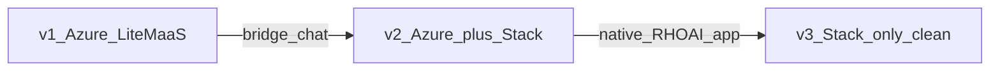
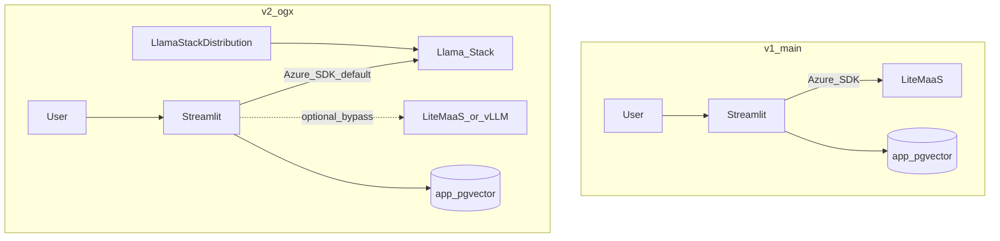
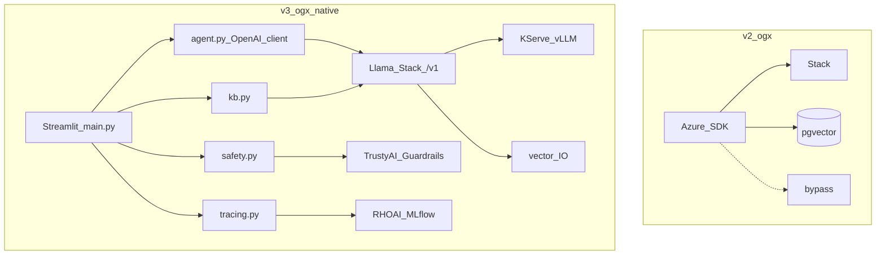
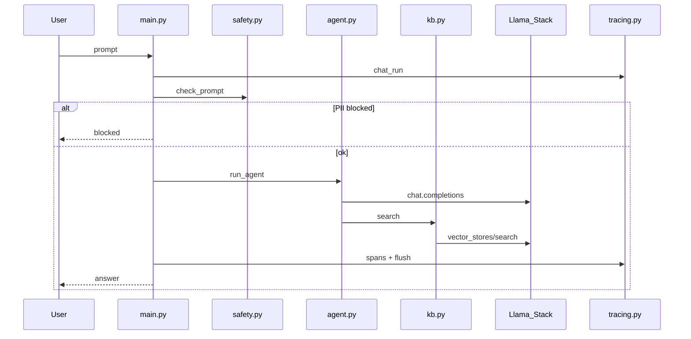

# Application & manifest changes

Delta guide for the Azure SDK → OpenShift AI demo across versions.

| Version | Branch | Namespace |
|---------|--------|-----------|
| **v1** | `main` | `agent-azuresdk-demo-main` |
| **v2** | `ogx` | `agent-azuresdk-demo-ogx` |
| **v3** | `ogx-native` | `agent-azuresdk-demo-ogx-native` |



---

## v1 → v2 (bridge)

**Intent:** Keep the **Azure SDK** agent and DIY RAG; land chat on OpenShift AI by defaulting to **Llama Stack** `/v1`. Optional UI bypass to LiteMaaS / vLLM for contrast.

### Architecture



### Application code

| Area | Change |
|------|--------|
| `app/config.py` | LLM from env/Secret (no hard-coded LiteMaaS defaults) |
| `app/main.py` | Provider switch: `llamastack` default, optional `litemaas` / `vllm` |
| `app/agent/loop.py` | `AzureKeyCredential` for in-cluster `http://`; thinking-model handling |
| RAG | **Unchanged** — app Postgres + local embeddings |

### Manifests

| Area | Change |
|------|--------|
| `deploy/base/llamastack.yaml` | **New** LSD |
| `deploy/overlays/ogx/` | `MODEL_PROVIDER=llamastack`, Stack URL/model |
| GitOps / Tekton | `application-ogx`, `pipeline-ogx` |

---

## v2 → v3 (OpenShift AI only — clean app)

**Intent:** Drop Azure / pgvector / provider bypass. v3 is a **small OpenShift AI app**: OpenAI client → Stack, Stack RAG, TrustyAI, MLflow.

### Architecture



### Application layout (v3 only)

```
app/
  main.py       # Streamlit UI (~150 lines)
  agent.py      # OpenAI client → Stack + search_knowledge_base tool
  kb.py         # Stack files / vector_stores
  safety.py     # TrustyAI PII shield
  tracing.py    # MLflow runs + spans
  documents.py  # upload validation
  config.py     # Stack / TrustyAI / MLflow env
```

**Removed from v3:** `azure-*`, `db.py`, `embeddings.py`, `fastembed`, pgvector path, provider switcher, dual RAG backends.

| Module | Role |
|--------|------|
| `agent.py` | `openai.OpenAI(base_url=Stack)` chat + tools |
| `kb.py` | ingest / list / delete / search on Stack vector store |
| `safety.py` | Guardrails Orchestrator HTTPS PII check |
| `tracing.py` | MLflow run + nested GenAI spans |
| `main.py` | UI only — no LiteMaaS/vLLM |

### Manifests

| Area | Change |
|------|--------|
| `agent-env-patch.yaml` | Stack + TrustyAI + MLflow only (no `MODEL_PROVIDER` / `RAG_BACKEND`) |
| `llamastack.yaml` | KServe inference; `FMS_ORCHESTRATOR_URL` HTTPS |
| `mlflow.yaml` + `mlflow-rbac.yaml` | Cluster MLflow + SA integration RoleBinding |
| `guardrails-my-first-model.yaml` | TrustyAI GO beside sample ISVC |
| `Dockerfile` | No embedding model bake-in |

### Chat turn



---

## Unchanged across the journey

- Tool name `search_knowledge_base` (v1–v3)
- Streamlit chat + upload/list/delete
- Strict GitOps (Argo + Tekton + `gitops-release.sh`)
- Side-by-side namespaces per branch

## Quick file map

### v1 → v2
```
app/main.py, app/agent/loop.py, app/config.py
deploy/base/llamastack.yaml
deploy/overlays/ogx/*
```

### v2 → v3
```
app/{main,agent,kb,safety,tracing,config,documents}.py   # rewrite
app/requirements.txt   # openai + mlflow[kubernetes]; drop azure/pgvector/fastembed
Dockerfile             # slim
deploy/overlays/ogx-native/agent-env-patch.yaml
deploy/base/mlflow.yaml, mlflow-rbac.yaml, llamastack.yaml
```
