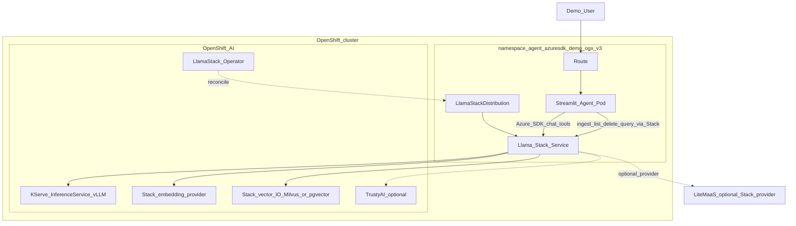
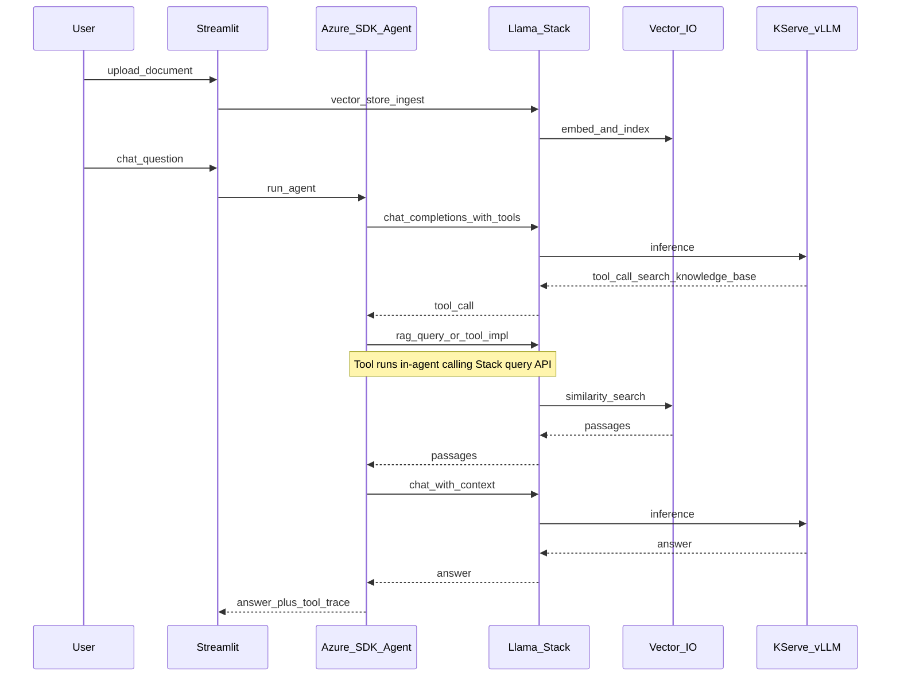

# Version 3 — Full OpenShift AI strength (`ogx` only)

**Status:** Spec only (not implemented).  
**Branch:** `ogx`  
**Proposed overlay / namespace:** `deploy/overlays/ogx-v3` → `agent-azuresdk-demo-ogx-v3`  
**Audience:** Customer who already builds agents with the **Azure AI Inference SDK**, containerizes them, and today runs on plain OpenShift (see v1). V3 shows the same agent pattern taking **maximum value from OpenShift AI**.

---

## Narrative

| Version | Pitch |
|---------|--------|
| **v1** (`main`) | Azure SDK agent on OpenShift; **no** OpenShift AI. Chat → LiteMaaS. RAG → app-owned pgvector + local embeddings. |
| **v2** (`ogx`) | **Bridge:** same agent + same app-pgvector RAG; **default chat** through Llama Stack (`/v1`). Optional bypass to LiteMaaS / vLLM for contrast. |
| **v3** (`ogx-v3`) | **Platform:** same Azure SDK chat/tool loop; **inference + embeddings + RAG** go through OpenShift AI (Llama Stack + KServe). App stops owning the vector DB path. |

Customer takeaway: *keep the Azure SDK agent; move AI plumbing onto OpenShift AI without a rewrite.*

---

## Goals

1. **Same agent contract** — `azure-ai-inference` chat + tool-calling; tool name `search_knowledge_base` unchanged.
2. **OpenShift AI is on the critical path** — removing Stack/KServe breaks the demo (unlike v2 bypasses).
3. **Show breadth of RHOAI**, not only “OpenAI-compatible URL”:
   - Llama Stack Distribution (operator)
   - KServe / InferenceService (in-cluster LLM)
   - Stack **vector IO** + **embedding** providers
   - (Optional stretch) TrustyAI / guardrails, Model Registry pointer, DSPA ingest job
4. **Strict GitOps** — same rules as v1/v2 (Argo only; `images.newTag` releases).
5. **Side-by-side** with v1/v2 via a dedicated namespace (do not overwrite v2).

## Non-goals

- Rewriting the agent onto the Llama Stack Python client as the primary SDK (Azure SDK remains the customer-facing client).
- Azure AI Foundry / Azure AI Search.
- Full multi-tenant SSO, HA Postgres, production Vault.
- Replacing Streamlit with a product UI.

---

## Decisions (locked for V3 spec)

| Topic | Choice |
|--------|--------|
| Agent SDK | Keep `azure-ai-inference` + tool loop |
| Default LLM path | Azure SDK → **Llama Stack** `/v1` only (no default bypass) |
| Serving | Stack inference → **KServe vLLM** (primary); LiteMaaS may remain a Stack *provider*, not a direct agent URL |
| RAG storage | **Stack vector IO** (inline Milvus acceptable; `remote::pgvector` if/when supported cleanly) |
| Embeddings | **Stack embedding provider** (e.g. sentence-transformers); remove local `fastembed` from the v3 image path |
| Doc ingest | UI → Stack vector-store / RAG APIs (register, insert, delete, query) |
| App Postgres | **Not** used for RAG in v3 (may disappear from overlay, or keep only if Stack metadata still needs it) |
| UI provider switch | Hide direct LiteMaaS/vLLM; optional “Stack upstream” is config on LSD, not agent env |
| Delivery | Tekton build + Argo Application `agent-azuresdk-demo-ogx-v3` |

---

## Architecture

### Runtime



### Sequence (RAG turn)



### What changes in the app (minimal)

| Area | v2 | v3 |
|------|----|----|
| `agent/loop.py` | Unchanged (Azure client) | Unchanged |
| `tools/rag.py` | `db.similarity_search` | Stack query client |
| `main.py` ingest/list/delete | `db.*` + `embed_texts` | Stack vector-store APIs |
| `embeddings.py` / `db.py` | Used | Unused / removed from v3 image path |
| Env | `LLAMA_STACK_*`, `DATABASE_URL` | `LLAMA_STACK_*`, vector-store id; no RAG `DATABASE_URL` |

---

## OpenShift AI capabilities to demo (checklist)

**Must-have (P0)**

- [ ] Llama Stack Distribution Ready (operator-managed)
- [ ] Azure SDK chat **only** via Stack `/v1`
- [ ] KServe-served model used for generation (visible in Stack model id / provider)
- [ ] Document ingest + delete via Stack
- [ ] `search_knowledge_base` grounded answers from Stack vector IO
- [ ] GitOps Application Synced/Healthy

**Should-have (P1)**

- [ ] Embeddings fully via Stack (no local ONNX in agent pod)
- [ ] LSD inference providers: in-cluster vLLM **and** LiteMaaS (switch at Stack/config, not agent)
- [ ] Demo caption / sidebar shows Stack model id + provider (proof you’re on RHOAI)

**Stretch (P2)**

- [ ] TrustyAI or Stack safety / guardrails on a sample prompt
- [ ] Model registered / referenced from OpenShift AI Model Registry
- [ ] Optional Tekton/DSPA job for batch ingest (same Stack store)
- [ ] Basic OpenShift / RHOAI metrics note in DEMO (latency, replica)

---

## Deploy layout (proposed)

```
deploy/
  overlays/
    ogx/          # v2 (unchanged story)
    ogx-v3/       # v3 — LSD + agent without app pgvector RAG
  gitops/
    application-ogx.yaml
    application-ogx-v3.yaml   # targetRevision: ogx, path: deploy/overlays/ogx-v3
```

Bootstrap: `BRANCH=ogx-v3` or `VERSION=v3` flag extending `scripts/bootstrap.sh`.

---

## Demo script (customer-facing)

1. **v1** — “Today”: Azure SDK → LiteMaaS, DIY pgvector; no RHOAI.
2. **v2** — “First step”: flip chat to Stack; RAG still DIY (low risk).
3. **v3** — “Full platform”: same UI/tools; ingest + retrieve + generate all on OpenShift AI; show LSD + InferenceService in console.

Success line: *We did not rewrite the agent — we moved AI dependencies onto OpenShift AI.*

---

## Success criteria

- Cold demo: upload → ask → tool trace shows retrieval → delete; all RAG I/O via Stack.
- Stopping Llama Stack or the InferenceService makes chat/RAG fail (platform dependency proven).
- Agent code diff from v2 is localized to document/RAG adapters + env (not a new agent framework).
- Argo `agent-azuresdk-demo-ogx-v3` Synced/Healthy after `images.newTag` release.

---

## Open questions (resolve before build)

1. Prefer Stack **OpenAI-compatible** RAG/helpers vs raw vector-IO REST for ingest?
2. Keep a thin Postgres only for Stack metadata, or all-inline Milvus?
3. Is TrustyAI in or out for the first V3 slice?
4. Namespace: `agent-azuresdk-demo-ogx-v3` (recommended) vs replace v2 in-place?
