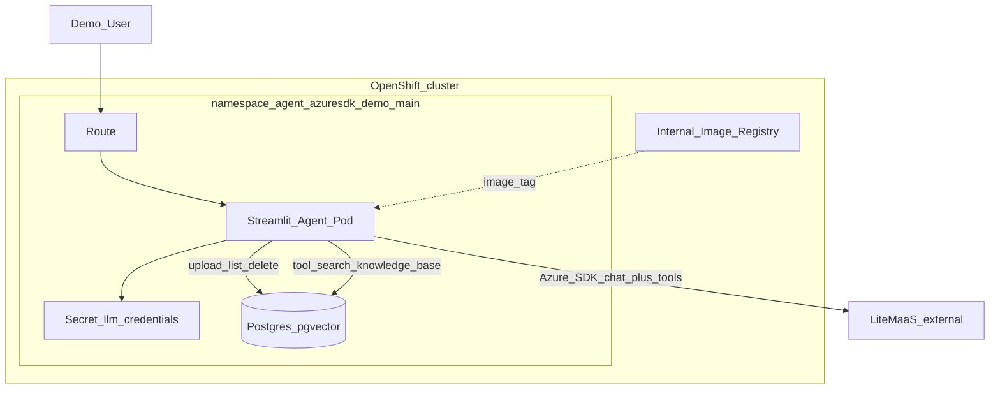
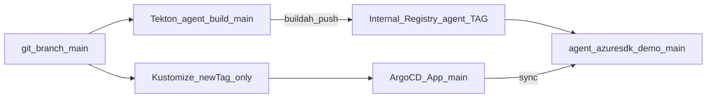
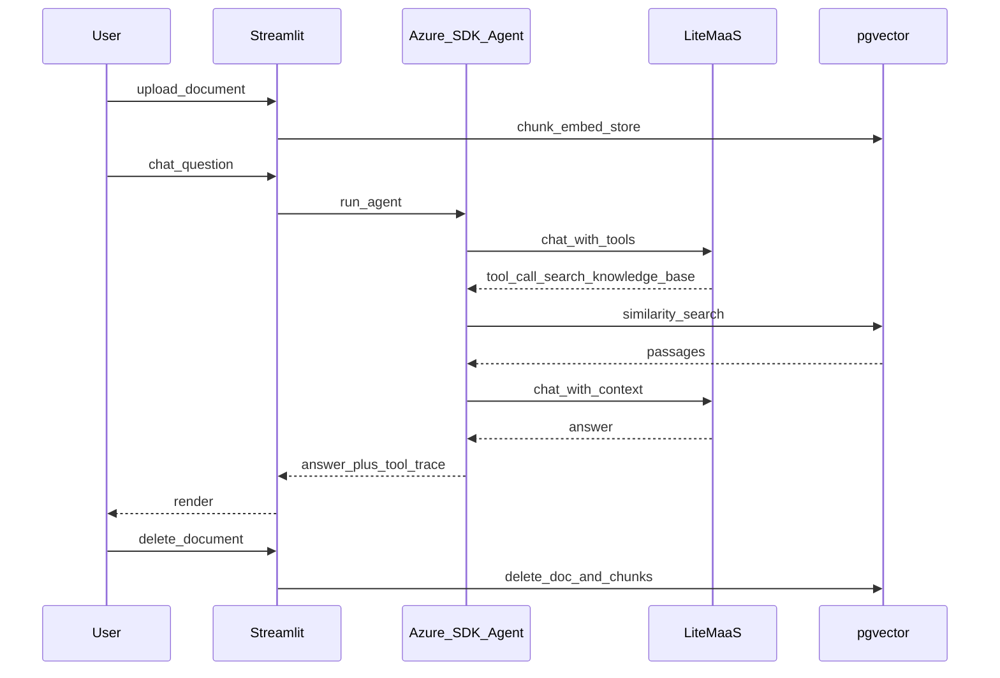
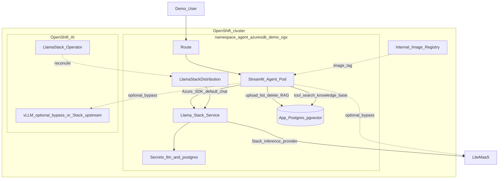
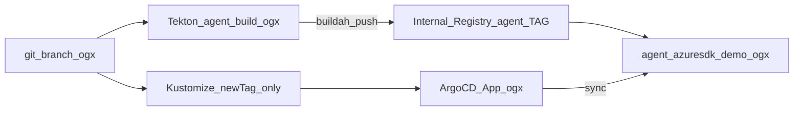
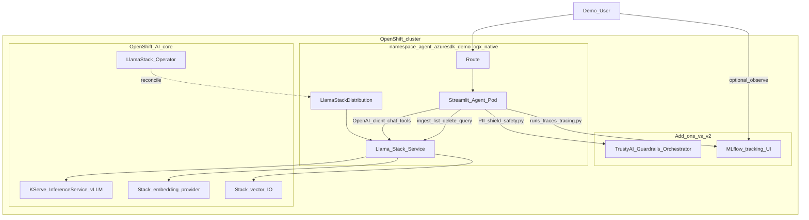
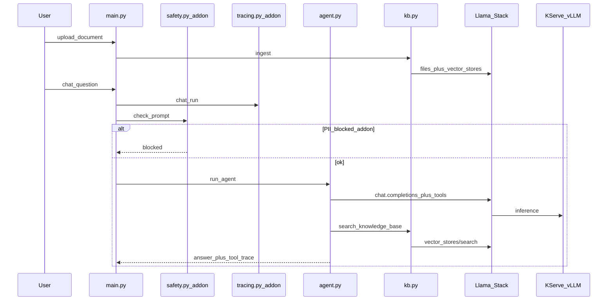

# OpenShift AI Azure Agent POC — Specification

Single source of truth for **v1**, **v2**, and **v3**. Keep this file identical on branches `main`, `ogx`, and `ogx-native`.

Extensible POC: Azure SDK agents (v1/v2) → OpenShift AI-native Stack app (v3); Streamlit UI; Tekton + OpenShift GitOps.

## Versioning

| Version | Git branch | Namespace | Focus |
|---------|------------|-----------|--------|
| **v1** | `main` | `agent-azuresdk-demo-main` | Plain OpenShift; Azure SDK → LiteMaaS; RAG → **app** pgvector + local embeddings. **No OpenShift AI.** |
| **v2** | `ogx` | `agent-azuresdk-demo-ogx` | **Bridge:** same agent + **same app-pgvector RAG**; **default chat** via Llama Stack `/v1`. Optional bypass to LiteMaaS / vLLM. |
| **v3** | `ogx-native` | `agent-azuresdk-demo-ogx-native` | **OpenShift AI core:** OpenAI client → Stack; Stack RAG + KServe. **Add-ons vs v2:** TrustyAI + MLflow. No Azure SDK. |

Branches and namespaces stay separate so demos can run side-by-side.

## Customer narrative

1. **Today (v1):** Build agents with Azure SDK, containerize, deploy on OpenShift — no OpenShift AI.
2. **First step (v2):** Keep the Azure agent and DIY RAG; point chat at Llama Stack (config-only) to land on OpenShift AI.
3. **Platform (v3):** Drop Azure / app-pgvector; ship a small OpenShift AI-native app (OpenAI client → Stack `/v1`) with Stack RAG + KServe. **Then layer add-ons vs v2:** **TrustyAI** (PII shield) and **MLflow** (runs/traces).

Takeaway: *v1/v2 keep Azure SDK; v3 rewrites the same UX onto OpenShift AI (chat + `search_knowledge_base`), then adds TrustyAI and MLflow.*

## Decisions

| Topic | Choice |
|--------|--------|
| Agent SDK (v1/v2) | `azure-ai-inference` + tool-calling loop |
| Agent client (v3) | **OpenAI Python SDK** → Llama Stack `/v1` (OpenShift AI only; no Azure, no bypass) |
| RAG tool | `search_knowledge_base` (read-only); upload/delete in UI |
| RAG (v1/v2) | App-owned Postgres **pgvector** + local `fastembed` / `BAAI/bge-small-en-v1.5` (384 dims) |
| RAG (v3) | Llama Stack vector IO + Stack embeddings only |
| Chat default (v2) | **Llama Stack** (`MODEL_PROVIDER=llamastack`) |
| Chat bypass (v2) | Optional UI: `litemaas` \| `vllm` (contrast only; not the story) |
| Chat (v3) | Stack `/v1` only |
| Serving (v3) | Stack inference → **KServe vLLM** (`vllm-inference/llama-32-3b-instruct`) |
| Safety (v3 add-on) | **TrustyAI** Guardrails Orchestrator — agent calls GO HTTPS directly (PII regex); not required for chat/RAG |
| Observability (v3 add-on) | **MLflow** (RHOAI) — agent logs runs + GenAI spans; not required for chat/RAG |
| UI | Streamlit: chat, tool traces, document list/upload/delete |
| Doc formats | `.txt`, `.md`, `.pdf` (max 5 MB) |
| Starter corpus | Empty |
| Build | Tekton per branch → internal registry |
| Deploy | **Strict GitOps:** Argo CD only applicator of `deploy/overlays/*`; release = `images.newTag` + git push (`scripts/gitops-release.sh`). No routine `oc apply -k` / `oc set image` / `oc set env`. |
| Git layout | Clean split: v1 → `main`; v2 → `ogx`; v3 → `ogx-native` |

## In scope

- v1 and v2 as implemented; bootstrap per branch; demo runbook ([DEMO.md](DEMO.md))
- LLM Secret (`LLM_API_KEY`, `LLM_BASE_URL`, `LLM_MODEL`) via `scripts/create-llm-secret.sh` (not in git)
- v2: `LlamaStackDistribution`, Postgres for **app RAG** (+ Stack metadata as configured), default Azure SDK → Stack `/v1`
- v3 **core:** Stack-only modules (`agent` / `kb`) + LSD / KServe / Stack RAG
- v3 **add-ons vs v2:** TrustyAI (`safety.py`) + MLflow (`tracing.py`)

## Out of scope

- Azure AI Foundry / Azure AI Search
- Vault/ESS, SSO, HA Postgres, GitHub Actions
- OCR, multi-user document ACLs, preloaded sample docs
- Llama Stack *Agents* Python SDK as the primary runtime (v3 uses OpenAI-compat client to Stack `/v1`)
- Azure SDK / app-pgvector / provider bypass in v3
- v2 does **not** move RAG onto Stack, and has **no** TrustyAI or MLflow (those are v3 add-ons)

## Extension points

- Add tools in `agent.py` (v3) or `app/tools/` (v1/v2) with stable names
- Swap Stack embedding / vector-IO providers via LSD (not agent)
- OAuth proxy, Tekton Triggers, progressive delivery

---

## Architecture — Version 1 (`main`)

### Runtime



### Delivery



### Sequence



---

## Architecture — Version 2 (`ogx`)

**Intent:** Minimal change from v1 — prove Azure SDK can talk to OpenShift AI (Llama Stack) for **chat**, while RAG stays the familiar app-pgvector path.

| Concern | Implementation |
|---------|----------------|
| Chat (default) | Azure SDK → `http://llamastack-demo-service:8321/v1` |
| RAG | Unchanged from v1: local embed + app Postgres/pgvector |
| LSD | Operator-managed; Stack may use its own vector/embedding providers internally — **not** used by the app KB |
| UI switch | Default `llamastack`; optional `litemaas` / `vllm` bypass for comparison |

### Runtime



### Delivery



---

## Architecture — Version 3 (`ogx-native`)

**Status:** Implemented / deployed (`ogx-native`, image `agent:v0.2.0`).  
**Overlay:** `deploy/overlays/ogx-native`  
**Argo Application:** `agent-azuresdk-demo-ogx-native` (`targetRevision: ogx-native`)

### Goals

1. **Core (vs v2):** Clean OpenShift AI app — OpenAI client → Stack `/v1` chat + tools; Stack vector IO for RAG; Stack → KServe for inference. Same UX tool: `search_knowledge_base`.
2. OpenShift AI on the critical path — removing Stack/KServe breaks chat and RAG.
3. **Add-ons vs v2 (not required for core chat/RAG):** **TrustyAI** Guardrails Orchestrator (PII shield) and **MLflow** (runs + GenAI traces).
4. Strict GitOps; side-by-side with v1/v2 via dedicated branch + namespace.

### Decisions (v3) — as deployed

| Topic | Choice |
|--------|--------|
| Chat client | **OpenAI Python SDK** → `http://llamastack-demo-service:8321/v1` |
| Model id | `vllm-inference/llama-32-3b-instruct` |
| Serving | Stack inference → **KServe** ISVC `llama-32-3b-instruct` (`my-first-model`) |
| RAG | Stack `/files` + `/vector_stores` (`STACK_VECTOR_STORE_NAME=agent-kb`) |
| Embeddings | Stack embedding model `sentence-transformers/nomic-ai/nomic-embed-text-v1.5` |
| App Postgres | Stack metadata only (not app RAG) |
| UI | No LiteMaaS/vLLM bypass |
| Modules (core) | `main.py`, `agent.py`, `kb.py`, `config.py`, `documents.py` |
| **Add-on: TrustyAI** | `safety.py` → `https://guardrails-service.my-first-model.svc:8032` (PII regex; fail-open on errors) |
| **Add-on: MLflow** | `tracing.py` → RHOAI tracking `https://mlflow.redhat-ods-applications.svc:8443`, workspace/experiment `agent-azuresdk-demo-ogx-native` |
| Platform prereq | DSC: Llama Stack Managed; TrustyAI + MLflow Managed for the add-ons |

### Runtime



### Sequence (chat turn — core + add-ons)



### App layout (v3)

| File | Role | vs v2 |
|------|------|--------|
| `main.py` | Streamlit UI | Rewritten (no provider switch) |
| `agent.py` | OpenAI client → Stack + tool loop | Replaces Azure `agent/loop.py` |
| `kb.py` | Stack vector store ingest/list/delete/search | Replaces app-pgvector RAG |
| `config.py` / `documents.py` | Env + upload validation | Slimmed |
| `safety.py` | TrustyAI Guardrails PII check | **Add-on** (new) |
| `tracing.py` | MLflow runs + spans | **Add-on** (new) |

**Removed vs v2:** `azure-*`, `agent/loop.py`, `tools/rag.py`, `db.py`, `embeddings.py`, `stack_kb.py`, provider switcher, local `fastembed` / app-pgvector RAG.

### Compare code (v2 → v3)

Prefer GitHub compare for demos:

https://github.com/maschind/agent-azuresdk-demo/compare/ogx...ogx-native

```bash
git fetch origin
git diff origin/ogx..origin/ogx-native -- app/ Dockerfile
git diff origin/ogx..origin/ogx-native -- deploy/overlays/ogx deploy/overlays/ogx-native deploy/base
git diff --stat origin/ogx..origin/ogx-native -- app/ Dockerfile deploy/
```

Narrative delta: [CHANGES.md](CHANGES.md) § v2 → v3. Runbook copy: [DEMO.md](DEMO.md) § Compare code.

### OpenShift AI demo checklist

**P0 — core (deployed)**

- [x] Llama Stack Distribution Ready
- [x] OpenAI client chat only via Stack `/v1`
- [x] KServe-served model for generation
- [x] Document ingest + delete via Stack
- [x] `search_knowledge_base` grounded from Stack vector IO
- [x] Embeddings fully via Stack (no local ONNX in agent)
- [x] UI shows Stack model id
- [x] GitOps Application Synced/Healthy (`agent:v0.2.0`)

**P0 — add-ons vs v2 (deployed)**

- [x] **TrustyAI** PII shield via Guardrails Orchestrator (blocked sample prompt)
- [x] **MLflow** run + GenAI trace for a chat turn (`agent-azuresdk-demo-ogx-native`)

**P1**

- [ ] LSD providers: in-cluster vLLM and LiteMaaS (switch at Stack, not agent)
- [ ] TrustyAI LM-Eval smoke eval

**P2 (stretch)**

- [ ] Model Registry reference
- [ ] Optional DSPA/Tekton batch ingest
- [ ] Platform-wide RHOAI observability dashboards

### Deploy layout (branch `ogx-native`)

```
deploy/
  overlays/ogx-native/          # agent env: Stack core + TrustyAI/MLflow add-on env
  gitops/application-ogx-native.yaml
  tekton/pipeline-ogx-native.yaml
  extras/guardrails-my-first-model.yaml   # TrustyAI GO (bootstrap into my-first-model)
```

Bootstrap: `BRANCH=ogx-native ./scripts/bootstrap.sh` (DSC: Llama Stack Managed; TrustyAI + MLflow Managed for add-ons).

---

## Cluster baseline (reference)

- OCP 4.20, RHOAI 3.4.2, Pipelines installed, GitOps installed via bootstrap if missing
- Internal registry Managed; domain `apps.ocp.9jkcd.sandbox3005.opentlc.com`
- Sample model `llama-32-3b-instruct` in `my-first-model` (v3 Stack → KServe upstream)
- Guardrails Orchestrator Service in `my-first-model` (v3 TrustyAI add-on)

## Success criteria

| Version | Criteria |
|---------|----------|
| Shared | Pipeline builds image; `newTag` + push → Argo `Synced`/`Healthy`; upload → RAG tool → grounded answer → delete |
| v1 | Works **without** Llama Stack / OpenShift AI |
| v2 | Default chat via Stack; RAG still app-pgvector; Azure SDK config-first; **no** TrustyAI / MLflow |
| v3 core | Clean Stack-only app; chat **and** RAG via Stack/KServe; stopping Stack/ISVC breaks the demo |
| v3 add-ons | TrustyAI blocks a PII prompt; MLflow shows a run/trace for a turn |
