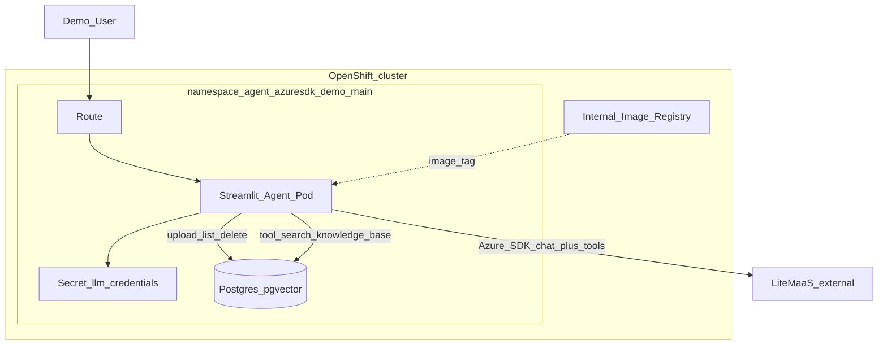
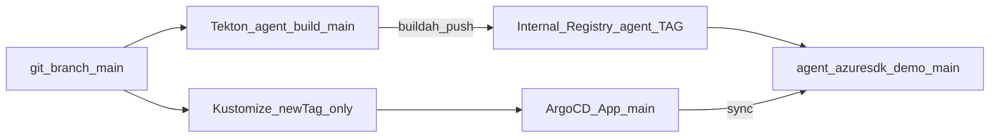
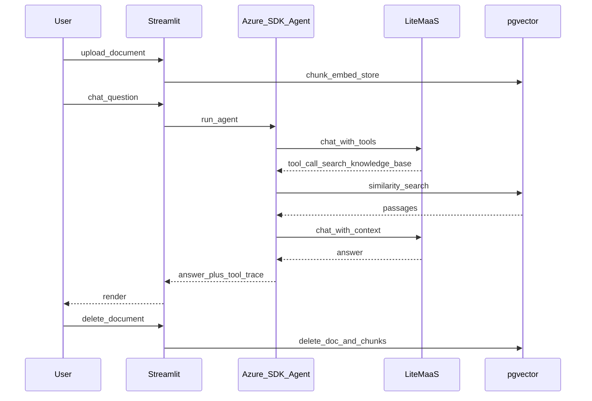
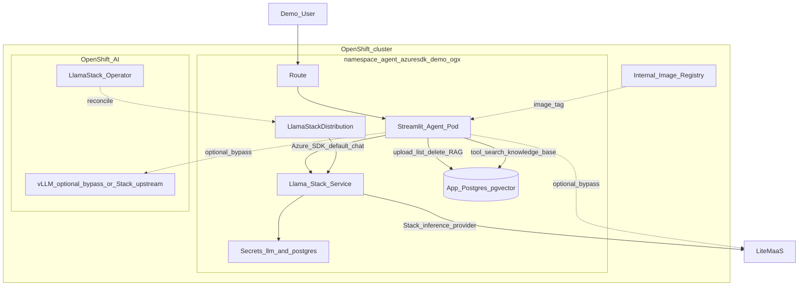
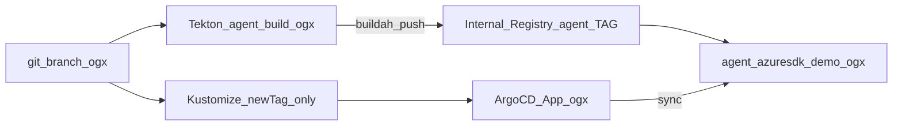
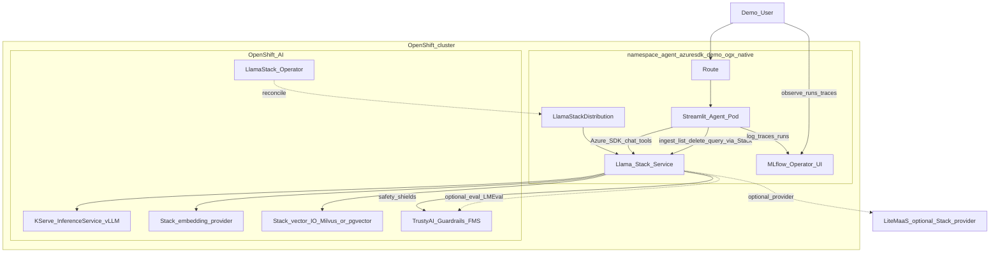
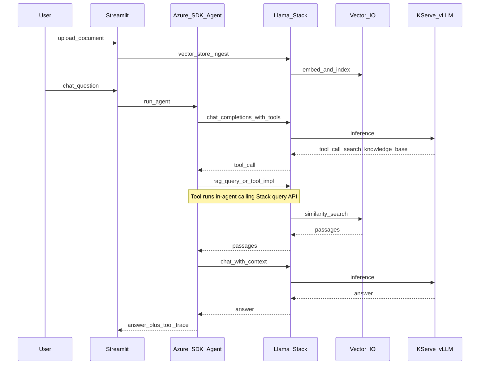

# OpenShift AI Azure Agent POC — Specification

Single source of truth for **v1**, **v2**, and **v3**. Keep this file identical on branches `main`, `ogx`, and `ogx-native`.

Extensible POC: Azure AI Python client + LiteMaaS / Llama Stack, RAG, Streamlit UI, Tekton + OpenShift GitOps.

## Versioning

| Version | Git branch | Namespace | Focus |
|---------|------------|-----------|--------|
| **v1** | `main` | `agent-azuresdk-demo-main` | Plain OpenShift; Azure SDK → LiteMaaS; RAG → **app** pgvector + local embeddings. **No OpenShift AI.** |
| **v2** | `ogx` | `agent-azuresdk-demo-ogx` | **Bridge:** same agent + **same app-pgvector RAG**; **default chat** via Llama Stack `/v1`. Optional bypass to LiteMaaS / vLLM. |
| **v3** | `ogx-native` | `agent-azuresdk-demo-ogx-native` | **Full OpenShift AI:** same Azure SDK agent; Stack / KServe RAG + inference; **TrustyAI** (safety/guardrails) + **MLflow** observability. **Spec → implement on `ogx-native`.** |

Branches and namespaces stay separate so demos can run side-by-side.

## Customer narrative

1. **Today (v1):** Build agents with Azure SDK, containerize, deploy on OpenShift — no OpenShift AI.
2. **First step (v2):** Keep the agent and DIY RAG; point chat at Llama Stack (config-only) to land on OpenShift AI.
3. **Platform (v3):** Keep the Azure SDK agent; move RAG/embeddings/serving onto OpenShift AI; add **TrustyAI** guardrails/eval and **MLflow** experiment/trace observability.

Takeaway: *keep the Azure SDK agent; move AI plumbing onto OpenShift AI without a rewrite.*

## Decisions

| Topic | Choice |
|--------|--------|
| Agent SDK | `azure-ai-inference` + tool-calling loop (all versions) |
| RAG tool | `search_knowledge_base` (read-only); upload/delete in UI |
| RAG (v1/v2) | App-owned Postgres **pgvector** + local `fastembed` / `BAAI/bge-small-en-v1.5` (384 dims) |
| RAG (v3) | Llama Stack vector IO + Stack embeddings |
| Chat default (v2) | **Llama Stack** (`MODEL_PROVIDER=llamastack`) |
| Chat bypass (v2) | Optional UI: `litemaas` \| `vllm` (contrast only; not the story) |
| Chat (v3) | Azure SDK → Llama Stack `/v1` only (no agent-level bypass) |
| Serving (v3) | Stack → **KServe vLLM** (primary); LiteMaaS may be a Stack *provider* |
| Safety (v3) | **TrustyAI** with Llama Stack (`trustyai_fms` / Guardrails Orchestrator); demo unsafe vs blocked prompt |
| Observability (v3) | **MLflow** (RHOAI MLflow Operator): experiment runs + tracing for agent/Stack turns |
| UI | Streamlit: chat, tool traces, document list/upload/delete |
| Doc formats | `.txt`, `.md`, `.pdf` (max 5 MB) |
| Starter corpus | Empty |
| Build | Tekton per branch → internal registry |
| Deploy | **Strict GitOps:** Argo CD only applicator of `deploy/overlays/*`; release = `images.newTag` + git push (`scripts/gitops-release.sh`). No routine `oc apply -k` / `oc set image` / `oc set env`. |
| Git layout | Clean split: v1 → `main`; v2 → `ogx`; v3 → `ogx-native` |

## In scope

- v1 and v2 as implemented; bootstrap per branch; demo runbook ([DEMO.md](DEMO.md))
- LLM Secret (`LLM_API_KEY`, `LLM_BASE_URL`, `LLM_MODEL`) via `scripts/create-llm-secret.sh` (not in git)
- v2: `LlamaStackDistribution`, Postgres for **app RAG** (+ Stack metadata as configured), default Azure SDK → Stack `/v1`
- v3: full platform path below including TrustyAI + MLflow (implement on `ogx-native`)

## Out of scope

- Azure AI Foundry / Azure AI Search
- Vault/ESS, SSO, HA Postgres, GitHub Actions
- OCR, multi-user document ACLs, preloaded sample docs
- Rewriting the agent onto the Llama Stack Python SDK as the primary client
- v2 does **not** move RAG onto Stack, TrustyAI, or MLflow (that is v3)

## Extension points

- Add tools under `app/tools/` with stable names
- Swap embedding backend or vector store behind the same UI (v3)
- OAuth proxy, Tekton Triggers, progressive delivery

---

## Architecture — Version 1 (`main`)

### Runtime



### Delivery



### Sequence



---

## Architecture — Version 2 (`ogx`)

**Intent:** Minimal change from v1 — prove Azure SDK can talk to OpenShift AI (Llama Stack) for **chat**, while RAG stays the familiar app-pgvector path.

| Concern | Implementation |
|---------|----------------|
| Chat (default) | Azure SDK → `http://llamastack-demo-service:8321/v1` |
| RAG | Unchanged from v1: local embed + app Postgres/pgvector |
| LSD | Operator-managed; Stack may use its own vector/embedding providers internally — **not** used by the app KB |
| UI switch | Default `llamastack`; optional `litemaas` / `vllm` bypass for comparison |

### Runtime



### Delivery



---

## Architecture — Version 3 (`ogx-native`)

**Status:** Spec (implement on branch `ogx-native`).  
**Overlay:** `deploy/overlays/ogx-native`  
**Argo Application:** `agent-azuresdk-demo-ogx-native` (`targetRevision: ogx-native`)

### Goals

1. Same agent contract — `azure-ai-inference` chat + tool-calling; tool name `search_knowledge_base` unchanged.
2. OpenShift AI on the critical path — removing Stack/KServe breaks the demo.
3. Show breadth of RHOAI: Llama Stack Distribution, KServe/InferenceService, Stack vector IO + embeddings, **TrustyAI** (guardrails/safety via Stack), **MLflow** (runs + traces).
4. Strict GitOps; side-by-side with v1/v2 via dedicated branch + namespace.

### Decisions (v3)

| Topic | Choice |
|--------|--------|
| Default LLM path | Azure SDK → **Llama Stack** `/v1` only |
| Serving | Stack inference → **KServe vLLM** (primary); LiteMaaS optional as Stack provider |
| RAG storage | **Stack vector IO** (inline Milvus OK; `remote::pgvector` if clean) |
| Embeddings | **Stack embedding provider** (e.g. sentence-transformers); no local `fastembed` in v3 path |
| Doc ingest | UI → Stack vector-store / RAG APIs |
| App Postgres | Not used for RAG (optional Stack metadata only) |
| UI provider switch | No direct LiteMaaS/vLLM; upstream switch is LSD config |
| TrustyAI | **Enabled** — Guardrails Orchestrator / `trustyai_fms` as Llama Stack safety provider; DSC `trustyai` Managed; demo at least one blocked/flagged prompt |
| MLflow | **Enabled** — RHOAI MLflow Operator (`mlflowoperators` Managed); log agent turns / Stack calls as runs + OpenTelemetry-style traces viewable in MLflow UI |
| Platform prereq | DataScienceCluster: Llama Stack, TrustyAI, MLflow components Managed (cluster-admin / bootstrap note) |

### Runtime



### Sequence (RAG turn)



### App delta vs v2 (minimal)

| Area | v2 (`ogx`) | v3 (`ogx-native`) |
|------|------------|-------------------|
| `agent/loop.py` | Azure client | Unchanged |
| `tools/rag.py` | `db.similarity_search` | Stack query client |
| `main.py` ingest/list/delete | `db.*` + `embed_texts` | Stack vector-store APIs |
| `embeddings.py` / `db.py` | Used | Unused / removed from v3 image path |
| Env | `LLAMA_STACK_*`, `DATABASE_URL` | `LLAMA_STACK_*`, vector-store id |

### OpenShift AI demo checklist

**P0**

- [ ] Llama Stack Distribution Ready
- [ ] Azure SDK chat only via Stack `/v1`
- [ ] KServe-served model for generation
- [ ] Document ingest + delete via Stack
- [ ] `search_knowledge_base` grounded from Stack vector IO
- [ ] **TrustyAI** guardrails on path (blocked/flagged sample prompt via Stack safety)
- [ ] **MLflow** run + trace visible for a demo chat turn
- [ ] GitOps Application Synced/Healthy

**P1**

- [ ] Embeddings fully via Stack (no local ONNX in agent)
- [ ] LSD providers: in-cluster vLLM and LiteMaaS (switch at Stack, not agent)
- [ ] UI shows Stack model id + provider
- [ ] TrustyAI LM-Eval (or Stack eval provider) smoke eval against the served model
- [ ] MLflow experiment named for the demo (`agent-azuresdk-demo-ogx-native`) with params/metrics

**P2 (stretch)**

- [ ] Model Registry reference
- [ ] Optional DSPA/Tekton batch ingest
- [ ] Platform-wide RHOAI observability dashboards (metrics/alerts TP)

### Deploy layout (branch `ogx-native`)

```
deploy/
  overlays/ogx-native/          # agent, LSD (safety providers), MLflow wiring notes/env
  gitops/application-ogx-native.yaml
  tekton/pipeline-ogx-native.yaml
```

Bootstrap: `BRANCH=ogx-native ./scripts/bootstrap.sh` (document DSC prerequisites: TrustyAI + MLflow Managed).

### Open questions (before build)

1. Stack OpenAI-compatible RAG helpers vs raw vector-IO REST for ingest?
2. Thin Postgres for Stack metadata vs all-inline Milvus?
3. MLflow: agent-side OpenTelemetry export vs Stack/provider-native tracing — prefer whichever lands with least agent change?

---

## Cluster baseline (reference)

- OCP 4.20, RHOAI 3.4.2, Pipelines installed, GitOps installed via bootstrap if missing
- Internal registry Managed; domain `apps.ocp.9jkcd.sandbox3005.opentlc.com`
- Sample model `llama-32-3b-instruct` in `my-first-model` (v2 bypass / v3 Stack upstream)

## Success criteria

| Version | Criteria |
|---------|----------|
| Shared | Pipeline builds image; `newTag` + push → Argo `Synced`/`Healthy`; upload → RAG tool → grounded answer → delete |
| v1 | Works **without** Llama Stack / OpenShift AI |
| v2 | Default chat via Stack; RAG still app-pgvector; Azure SDK config-first |
| v3 | Stack/KServe on critical path for chat **and** RAG; TrustyAI blocks/flags a demo prompt; MLflow shows a run/trace for a turn; stopping Stack/ISVC breaks the demo; agent diff from v2 limited to RAG/doc adapters + observability hooks + env |
