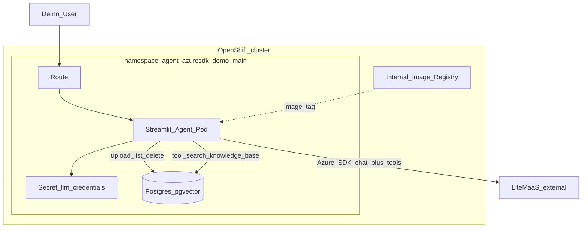
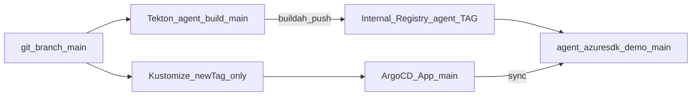
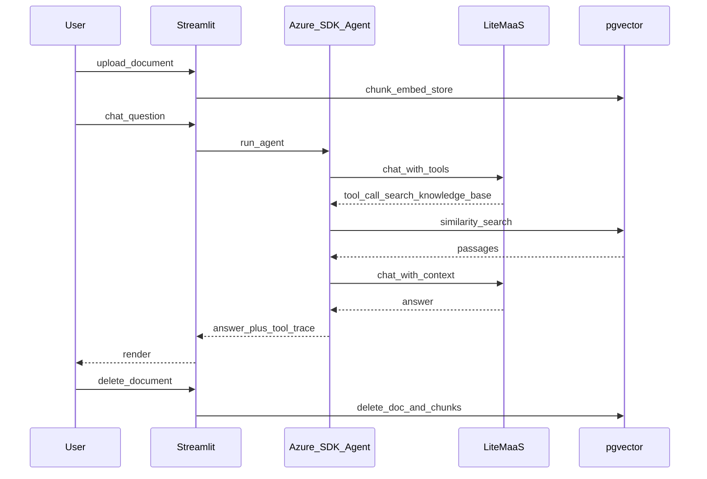
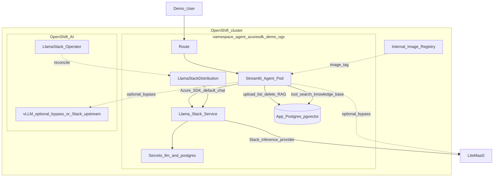
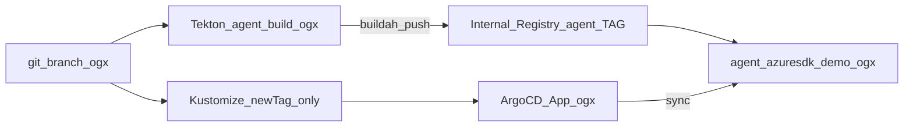

# OpenShift AI Azure Agent POC — Specification

Extensible POC: Azure AI Python client + LiteMaaS / Llama Stack, RAG, Streamlit UI, Tekton + OpenShift GitOps.

## Versioning

| Version | Git branch | Namespace | Focus |
|---------|------------|-----------|--------|
| **v1** | `main` | `agent-azuresdk-demo-main` | Plain OpenShift; Azure SDK → LiteMaaS; RAG → **app** pgvector + local embeddings. **No OpenShift AI.** |
| **v2** | `ogx` | `agent-azuresdk-demo-ogx` | **Bridge:** same agent + **same app-pgvector RAG**; **default chat** via Llama Stack `/v1`. Optional bypass to LiteMaaS / vLLM. |
| **v3** | `ogx-native` | `agent-azuresdk-demo-ogx-native` | **Full OpenShift AI:** same Azure SDK agent; inference + embeddings + RAG via Stack / KServe. See [SPEC-v3.md](SPEC-v3.md). |

v1 (`main`), v2 (`ogx`), and v3 (`ogx-native`) are separate branches/namespaces so demos can run side-by-side.

## Customer narrative

1. **Today (v1):** Build agents with Azure SDK, containerize, deploy on OpenShift — no OpenShift AI.
2. **First step (v2):** Keep the agent and DIY RAG; point chat at Llama Stack (config-only) to land on OpenShift AI.
3. **Platform (v3):** Keep the Azure SDK agent; move RAG/embeddings/serving onto OpenShift AI for full platform value.

## Decisions

| Topic | Choice |
|--------|--------|
| Agent SDK | `azure-ai-inference` + tool-calling loop (all versions) |
| RAG tool | `search_knowledge_base` (read-only); upload/delete in UI |
| RAG (v1/v2) | App-owned Postgres **pgvector** + local `fastembed` / `BAAI/bge-small-en-v1.5` (384 dims) |
| RAG (v3) | Llama Stack vector IO + Stack embeddings ([SPEC-v3.md](SPEC-v3.md)) |
| Chat default (v2) | **Llama Stack** (`MODEL_PROVIDER=llamastack`) |
| Chat bypass (v2) | Optional UI: `litemaas` \| `vllm` (contrast only; not the story) |
| UI | Streamlit: chat, tool traces, document list/upload/delete |
| Doc formats | `.txt`, `.md`, `.pdf` (max 5 MB) |
| Starter corpus | Empty |
| Build | Tekton per branch/overlay → internal registry |
| Deploy | **Strict GitOps:** Argo CD only applicator of `deploy/overlays/*`; release = `images.newTag` + git push (`scripts/gitops-release.sh`). No routine `oc apply -k` / `oc set image` / `oc set env`. |
| Git layout | Clean split: v1 → `main`; v2 → `ogx`; v3 → `ogx-native` |

## In scope

- v1 and v2 as above; bootstrap per branch; demo runbook
- LLM Secret (`LLM_API_KEY`, `LLM_BASE_URL`, `LLM_MODEL`) via `scripts/create-llm-secret.sh` (not in git)
- v2: `LlamaStackDistribution`, Postgres for **app RAG** (+ Stack metadata as configured), default Azure SDK → Stack `/v1`
- v3: specified in [SPEC-v3.md](SPEC-v3.md) (implementation follow-on)

## Out of scope (v1/v2)

- Azure AI Foundry / Azure AI Search
- Vault/ESS, SSO, HA Postgres, GitHub Actions
- OCR, multi-user document ACLs, preloaded sample docs
- v2 does **not** move RAG onto Stack (that is v3)

## Extension points

- Add tools under `app/tools/` with stable names
- Swap embedding backend or vector store behind the same UI (v3)
- OAuth proxy, Tekton Triggers, progressive delivery

---

## Architecture — Version 1 (`main`)

### Runtime

### Delivery

### Sequence

---

## Architecture — Version 2 (`ogx`)

**Intent:** Minimal change from v1 — prove Azure SDK can talk to OpenShift AI (Llama Stack) for **chat**, while RAG stays the familiar app-pgvector path.

| Concern | Implementation |
|---------|----------------|
| Chat (default) | Azure SDK → `http://llamastack-demo-service:8321/v1` |
| RAG | Unchanged from v1: local embed + app Postgres/pgvector |
| LSD | Operator-managed; Stack may use its own vector/embedding providers internally — **not** used by the app KB |
| UI switch | Default `llamastack`; optional `litemaas` / `vllm` bypass for comparison |

### Runtime

### Delivery

---

## Architecture — Version 3 (`ogx-native`)

Full specification: **[SPEC-v3.md](SPEC-v3.md)** (implemented on branch `ogx-native`).

Summary: same Azure SDK agent; chat **and** RAG/embeddings via Llama Stack; KServe vLLM on the path; app pgvector RAG removed.

---

## Cluster baseline (reference)

- OCP 4.20, RHOAI 3.4.2, Pipelines installed, GitOps installed via bootstrap if missing
- Internal registry Managed; domain `apps.ocp.9jkcd.sandbox3005.opentlc.com`
- Sample model `llama-32-3b-instruct` in `my-first-model` (v2 bypass / v3 Stack upstream)

## Success criteria

| Version | Criteria |
|---------|----------|
| Shared | Pipeline builds image; `newTag` + push → Argo `Synced`/`Healthy`; upload → RAG tool → grounded answer → delete |
| v1 | Works **without** Llama Stack / OpenShift AI |
| v2 | Default chat via Stack; RAG still app-pgvector; Azure SDK config-first |
| v3 | See [SPEC-v3.md](SPEC-v3.md) — Stack/KServe on critical path for chat **and** RAG |
