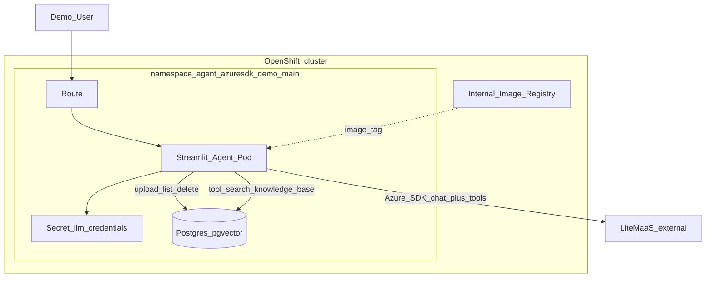
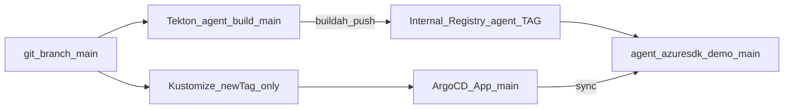
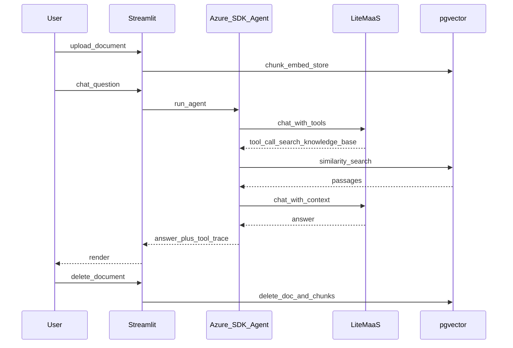
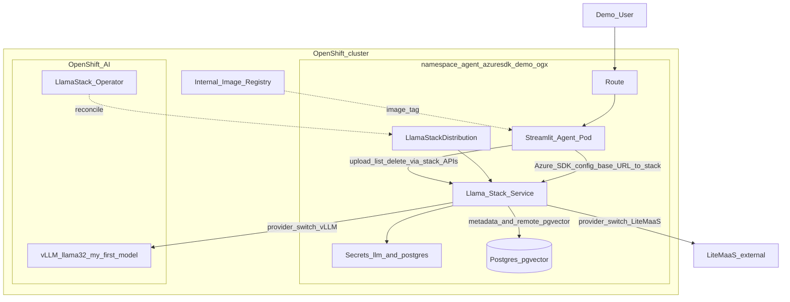
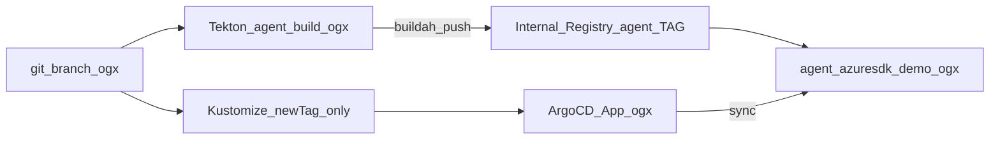

# OpenShift AI Azure Agent POC — Specification

Extensible POC: Azure AI Python client + LiteMaaS / Llama Stack, pgvector RAG, Streamlit UI, Tekton + OpenShift GitOps.

## Versioning

| Version | Git branch | Namespace | Focus |
|---------|------------|-----------|--------|
| **v1** | `main` | `agent-azuresdk-demo-main` | Simple OpenShift containers; Azure SDK → LiteMaaS; RAG tool → pgvector |
| **v2** | `ogx` | `agent-azuresdk-demo-ogx` | OpenShift AI Llama Stack; Azure SDK config-only → Stack `/v1` |

Both branches are buildable in parallel. Each has its own namespace (branch suffix) so demos can run side-by-side.

## Decisions

| Topic | Choice |
|--------|--------|
| LLM (v1) | LiteMaaS OpenAI-compatible API via Secret `llm-credentials` |
| Agent SDK | `azure-ai-inference` + tool-calling loop |
| RAG tool | `search_knowledge_base` (read-only); upload/delete in UI |
| Embeddings (v1) | Local (`fastembed` / BAAI/bge-small-en-v1.5, 384 dims) |
| UI | Streamlit: chat, tool traces, document list/upload/delete |
| Doc formats | `.txt`, `.md`, `.pdf` (max 5 MB) |
| Starter corpus | Empty |
| Build | Tekton per branch → internal registry |
| Deploy | **Strict GitOps:** Argo CD Application is the only applicator of `deploy/overlays/*`; app release = manual Kustomize `images.newTag` + git push only (`scripts/gitops-release.sh`). No routine `oc apply -k` / `oc set image` / `oc set env`. |
| Git layout | Clean split: v1 deployables on `main`, v2 on `ogx` |

## In scope

- v1 and v2 as above; bootstrap per branch; demo runbook
- LLM Secret (`LLM_API_KEY`, `LLM_BASE_URL`, `LLM_MODEL`) created via `scripts/create-llm-secret.sh` (CLI prompts; not stored in git)
- v2: `LlamaStackDistribution`, Postgres Secrets, `remote::pgvector`, model switch LiteMaaS \| in-cluster vLLM

## Out of scope

- Azure AI Foundry / Azure AI Search
- Vault/ESS, SSO, HA Postgres, TrustyAI, GitHub Actions
- OCR, multi-user document ACLs, preloaded sample docs

## Extension points

- Add tools under `app/tools/` with stable names
- Swap embedding backend or vector store behind the same UI
- OAuth proxy, Tekton Triggers, progressive delivery

---

## Architecture — Version 1 (`main`)

### Runtime

### Delivery

### Sequence

---

## Architecture — Version 2 (`ogx`)

See branch `ogx` for deployables. Summary: Streamlit + Azure SDK with `LLM_BASE_URL` pointing at Llama Stack; LSD uses Postgres + `remote::pgvector`; inference provider switchable (LiteMaaS or in-cluster vLLM `llama-32-3b-instruct`).

### Runtime

### Delivery

## Cluster baseline (reference)

- OCP 4.20, RHOAI 3.4.2, Pipelines installed, GitOps installed via bootstrap if missing
- Internal registry Managed; domain `apps.ocp.9jkcd.sandbox3005.opentlc.com`
- Sample model `llama-32-3b-instruct` in `my-first-model` (used by v2 switch)

## Success criteria

- Pipeline builds image; manual `newTag` + push rolls app via Argo CD (`Synced` / `Healthy`)
- Argo Application can reconcile the overlay (controller has `admin` on the target namespace via `deploy/gitops/argocd-namespace-rbac.yaml`)
- Upload → RAG tool → grounded answer → delete
- v1 works without Llama Stack; v2 uses Stack APIs with Azure SDK config-first
